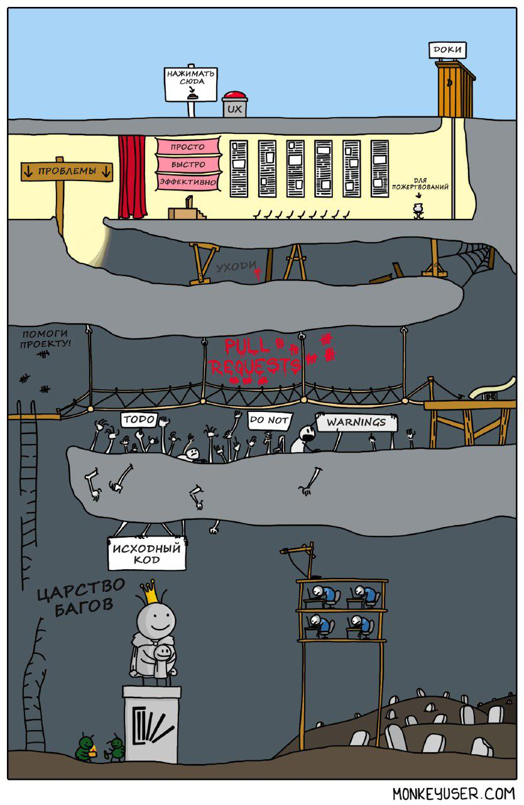

# Agile Lite для разработчиков

Если вы уже достаточно давно работаете разработчиком в сфере IT, то вы наверняка хоть бы раз испытывали состояние выгорания. У такого эмоционального состояния найдется множество причин, но все они могут быть описаны как результат напряженной работы под большим стрессом достаточно продолжытельное время.

Все начинается вместе с проектом. Вначале проект имеет подробное описание требований и сроки дедлайна. По ходу его активной разработки требования постоянно изменяются, а сроки окончания остается на месте. И вот наступает дедлайн, в который вы, естественно, не укладываетесь. Взглянув на начало проекта вы осознаете, что требования к проекту теперь совершенно отличается от тех, что были изначально. 
Конечно, вы считаете себя виноватым в том, что не уложились в сроки дедлайна, и вы все чаще начинаете работать сверхурочно, чтобы что-то доделать или исправить. И вот к концу очередной напряженной рабочей недели, неважно как усердно вы ее отработали, менеджер проекта вами по-прежнему не доволен, т.к. проект постоянно не укладвается в установленные сроки разработки.

Отдыхая после работы или находясь в отпуске вы постоянно считаете, что вы бездельник и моглибы потратить свое свободное время на доработку проекта. 
Со временем вы все больше начинаете считать, что весь проект и поддержка команды лежит только на вас.
В офисе к вам так часто обращаются с разными просьбами, что ваше вынужденное отсутсвие на рабочем месте воспринимается как прогул, почти все сотрудники знают когда вы уходите и приходите и вы не можете незаметно отлучиться даже на 5 минут. 
И всегда когда кто-то вас спрашивает как дела, вы постоянно повторяете одно и тоже: "Я занят! Я очень занят!".

И наконец наступает момент когда вы говорите самому себе: "Да пошло оно все...". 
Возможно, вы меняете свою работу и устраиваетесь в другую IT компанию, но там все тоже самое повторяется снова и снова.
Возможно, вы всетаки остаетесь, но теперь становитесь пофигистом, при любом обращении к вам хамите и посылаете людей подальше и в конце-концов вас увольняют за неподобавющее поведение или оскарбление кого-то из менеджеров.
Возможно вы решаете просто кардинально сменить сферу своей деятельности и уйти из сферы IT разводить кроликов или продавать фрукты.

> Вобщем, как в той поговореке: если хочешь убить свое увлечение или хобби - сделай его своей работой.

У меня есть решение. Это гибкая форма [Agile разработки](https://ru.wikipedia.org/wiki/Гибкая_методология_разработки), которая пожет вам избежать выгорания. Я называю ее `Agile Lite` (Agile без перегрева).

Ее оснонвые правила следующие: 
* Каждый цикл разработки включает 3 недели спринта и 1 неделю разгрузки, в которую выполняется планирование спринта на следующий период. Мантра: **3 недели спринт / 1 неделя разгрузки**.
* Сприн включает в себя решение задач (`Issues`), и разработчики их решают, и регистрируют их выполнение в системе багтрекинга.
* Как только начался 3-х недельний сприн, в этот период никакие новые задачи не могут быть добавлены в систему трекинга, только удалены/закрыты. Это исключает частые переключения разработчиков между контектсами и это хорошо.
* Задачей (`Issue`) является любой блок работы, который занимает от 4 до 8 часов рабочего времени разработчика и который прописан в виде описанной задачи (таска) в систему трекинга.
* Любые задачи в текущем спринте, которые не были завершены по окончанию очердного периода спринта, пересматриваются в течении периода недельной разгрузки и планирования, и переносятся в следующий 3-х недельний спринт.
* Мы отказваемся от такого понятия как переработки. Разработчики на постоянной основе получают новые порции задач и получают необходимое время на их выполнение, а также время на разгрузку своих мозгов. Менеджерские затраты на управление при этом минимальны.

Это и есть описание методологии разработки по `Agile Lite`. Естественно вы можете подкорректировать эти описания под свои нужды. Но есть один отличительный признак Agil Lite, который я хотел бы отметить - это то, что мы явно гооврим: "Эй, команды работающие по методологии agile тоже могут выгорать также как и команды работающие по другим методология, возможно нам надо добавить еще некоторых правил, чтобы уменьшить вероятность выгорания нашего движка, которым явялется наша команда".

Давайте прекратим перегревать наши движки! У нас итак много работы, которую мы должны сделать. По сути бездонная яма работы. Но жизнь коротка, чтобы тратить ее всю на работу, стресс и выгорание.

----

If you would like to see more workplaces implement a system such as this, please star this repo on github and share on social media to increase visibility.
Dave Sullivan 2019 dave.brian.sullivan@gmail.com

----

Original Source: [Agile_Lite_for_Developers](https://github.com/davebs/AgileLite/blob/master/agile_lite_for_developers.md)

